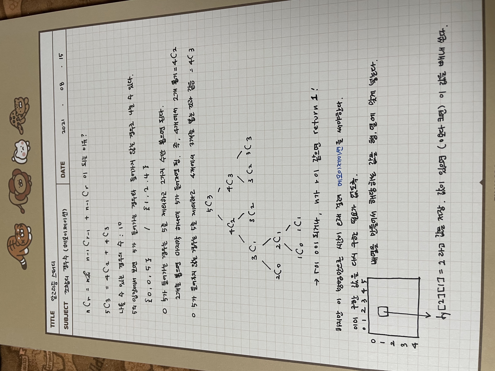

# 재귀함수와 완전탐색(DFS:깊이우선탐색)

## 1. 재귀함수와 스택프레임(중요)

## 21.08.04

### 👩🏻‍💻 My solution

우선 풀어본다고 나는 for문 이용해서 풀었음 ㅋㅋ

### 👨‍🏫 Teacher's solution

재귀함수는 기본적으로 스택을 이용한다.

```js
function tSolution(n) {
  function DFS(L) {
    if (L === 0) return;
    else {
      DFS(L - 1);
      console.log(L);
    }
  }
  DFS(n);
}
```

D(3) -> D(2)가 호출되는데 아래의 console.log(L) 은 실행되지 못하고 콜스택에 쌓임
그다음으로 D(1)이 호출.
이제 더 호출될 것이 없고 실행할 것은 아까 실행되지 못하고 스택에 쌓였던
console.log(1) -> console.log(2) -> console.log(3) 가 차례로 실행됨

---

<br>

## 2. 이진수 출력(재귀)

## 21.08.05

### 👩🏻‍💻 My solution

1번 문제를 참고해 재귀함수를 스스로 만들어보았다!
나는 이진수 만들 때 십진수를 2로 계속 나누다보면, 이진수의 몫이 1이 될 때 이진수 계산이 멈춘다는 걸 이용해서 만들었다.
선생님 방법이 코드가 한 줄 줄어들기 때문에 더 깔끔한 거 같다.
내 방식은 몫이 1일 때 답에 더해주는 코드가 있는데, 선생님 방법은 else에서 더해주는 것으로 다 끝난다.

### 👨‍🏫 Teacher's solution

선생님은 입력한 숫자가 0이 될 때까지 재귀함수를 반복하는 것으로 하셨다.
역시나 재귀함수에 들어가는 숫자 parameter는 2로 나눈 몫이 들어가는 것으로 한다.

---

<br>

## 3. 이진트리순회(DFS: 깊이우선탐색)

## 21.08.06

### 👩🏻‍💻 My solution

직접 연필로 함수가 호출되고 출력되는 거 해볼 것!
이진트리 했던 구조는 맨 위에 부모가 있고,
부모 밑에 왼쪽 자식은 (부모 \* 2), 오른쪽 자식은 (부모 \* 2 + 1) 이었다.
규칙이 있는듯?

### 👨‍🏫 Teacher's solution

---

<br>

## 4. 부분집합 구하기(이진트리 DFS)

## 21.08.07

### 👩🏻‍💻 My solution

### 👨‍🏫 Teacher's solution

이것도 역시 이진트리 방식으로 푼다.
다만 방식은 이러하다.
1이 주어지면 그 다음 수인 2가 각각 두 갈래이다.
즉, 앞으로 1이 포함되냐 안되느냐로 나뉘는 것.
그리고 그 2에서 3으로 갈 때도 두 갈래인데 이건 2가 포함되느냐 여부를 결정하는 것이다.
그래서 그걸 체크해줄 수 있는 배열을 만들어 포함되면 해당하는 번호에 1과 0을 할당해 포함 여부를 파악한다.
만약 배열에 1이 있다면 해당 인덱스의 숫자가 포함되었다는 뜻이므로 그 숫자를 쉽게 출력할 수 있다.
0이면 출력되지 않아 공집합의 경우를 제거할 수 있다.

---

<br>

## 5. 합이 같은 부분집합(이진트리 DFS)

## 21.08.08

### 👩🏻‍💻 My solution

선생님 풀이를 보면 알겠는데 아직 스스로 짜기엔 조금 아쉬운 사고력 ㅠㅠ
포함과 포함 안되는 경우, 그리고 패턴이 있는지 확인하기 !!
선생님 말씀대로 우선은 if는 멈추는 경우고 else는 판별하는 곳인데,
포함되는 경우 안되는 경우(o, x)로 나눠서 코드를 적을 수 있도록 한다!

### 👨‍🏫 Teacher's solution

배열 내 숫자의 모든 합(total)이 내가 만든 부분집합 배열의 합(sum)을 뺐을 때 sum과 일치하면,
같은 합의 부분집합이 2개 있다는 뜻이 된다.
이번에 재귀함수를 만들 때는 레벨과(이진트리에서 한 단계씩 내려간다는 의미) 합을 계산하는 sum을 인자로 넘겨준다.

```js
DFS(0, 0);
```

그리고 이진트리에서 해왔던 것 처럼, 숫자를 포함하는 경우와 포함하지 않는 경우를 나눈다.
그대로 레벨은 증가하되, 레벨에 해당하는 숫자(배열에 있는 인덱스와 같음)이 더해지느냐 안더해지느냐로 나눈다.
그러면 모든 경우의 수가 계산이 되고, 마지막에 멈추게 하는 것은 레벨이 배열 내 길이와 같아지면 멈춘다.
그리고 그때 배열 내 총합과 부분집합의 합을 빼주고 그 결과가 부분집합의 합인지 판별하게 해준다.
flag를 쓴 이유는 이번 문제 조건에서 한 번이라도 정답에 일치하는 경우가 나오면 되기 때문에,
이후에 더 함수들이 스택에 쌓이는 것을 방지하기 위해서 flag가 있으면 함수를 끝낼 수 있도록 만든 것이다.

---

<br>

## 6. 바둑이 승차(이진트리 DFS)

## 21.08.09

### 👩🏻‍💻 My solution

어제 문제 풀이를 응용하니 쉬웠다.
강아지 몸무게를 포함하는 경우, 안포함하는 경우를 나눈다.
이때 중요한 것은 C 킬로그램 이상 태울 수 없다고 했으므로,
C를 넘지 않되 무게가 가장 무거운 것을 찾는 것이다.
그래서 if문을 많이 넣었다.
maxWeight라는 변수를 하나 만들어서 최대 합과 C를 비교할 수 있도록 만들었다.

### 👨‍🏫 Teacher's solution

바둑이를 태운다 안태운다 경우로 나눔.
내 풀이랑 비슷한데 무게가 넘치는 것을 처리해주는 방법과 Math.max를 이용하신게 다름

---

<br>

## 7. 최대점수 구하기(이진트리 DFS)

## 21.08.10

### 👩🏻‍💻 My solution

재귀함수 - 이진트리의 전형!
인자를 세개 받고, 리미트를 걸어줘야하는 부분이 시간이라는 것만 알면 쉽게 풀 수 있었음

### 👨‍🏫 Teacher's solution

문제를 풀거냐 말거냐 선택의 문제. -> 이진트리!!
모든 경우를 다 해봐야 함. 내 풀이와 거의 동일.
이제 이런 문제는 경우가 적기 때문에 재귀함수로 풀 수 있지만, 나중엔 다이나믹 방식으로 풀어야된다고 하심

---

<br>

## 8. 중복순열(다중 for문과 재귀의 차이점)

## 21.08.11

### 👩🏻‍💻 My solution

재귀를 했을 때 어떻게 세가지 경우를 대응할 수 있는지 생각을 못해냈다 ㅜ

### 👨‍🏫 Teacher's solution

다중포문을 이용하지 않는 이유.
던지는 숫자인 m만큼의 for문을 만들어줘야한다.
하지만 재귀를 만들면 for문을 일일이 더 만들어주지 않아도 대응이 가능하다.
우선 한 번 던질 때 세 가지 경우가 있으므로,
D(0)일 때 1, 2, 3 세 경우로 뻗어가고, D(1) 또한 마찬가지
D(2) 일 때는 함수가 끝난다. (2는 m)
임시 배열을 만들어 해당하는 경우를 배열에 저장한다.
배열의 0번쨰는 첫번째 던지는 경우, 배열의 1번쨰는 두번째 던지는 경우를 뜻한다.

---

<br>

## 9. 동전교환(DFS-Cut Edge Tech)

## 21.08.12

### 👩🏻‍💻 My solution

재귀로 하는 경우가 생각이 안났음.
무조건 현재 있는 금액의 수(15)에서 하나씩 빼줘서 0으로 만들어야겠다고 생각했음.
for + while 조합으로 풀었당.

### 👨‍🏫 Teacher's solution

중복순열의 답을 구하는 과정과 비슷하다.
다른 점은 답을 구하는 과정에서 발생할 수 있는 단계(L)의 중복을 제거해주는 것이다.
1, 2, 5라는 경우가 있으므로 첫번째 단계에서 0으로 시작해 3갈래로 뻗고, 그 3갈래에서 각각 3갈래씩 차례로 뻗어나간다고 생각하면 된다.
이진트리의 경우와 달리 경우가 2개 이상인 경우에는 재귀함수와 for문을 쓸 수 있다는 것을 기억하자!!
그리고 만약 14번을 해서 답인 15가 구해지면, 다른 경우에서 또 14번했다는 것이 나올 수도 있다.
이걸 방지해주기 위해서 이미 답에 14가 있다면 그걸 또 다시 반복해 answer에 넣거나 비교 자체를 할 필요가 없다.

```js
if (L >= answer) return;
```

위 코드를 통해 혹시나 발생할 수 있는 중복을 제거한다.
만약 내림차순 정렬을 한다면 더 빠르게 답을 구할 수 있다.

---

<br>

## 10. 순열 구하기

## 21.08.13

### 👩🏻‍💻 My solution

숫자를 두개씩 넣는 건 성공했지만 중복제거를 하지는 못함.
선생님의 풀이를 보니 중복제거는 else,
즉 재귀함수를 실행하는 쪽에서 해야한다.

### 👨‍🏫 Teacher's solution

주어진 배열에 담긴 수를 썼는지 안썼는지 확인하는 배열도 추가로 필요하다.
맨 처음엔 그 check 배열을 모두 0으로 만들고, 그 수를 썼다면 1로 바꾸고 재귀 함수를 실행한다.
그리고 다시 그 check 배열의 수를 0으로 만든다.
**중복을 제거해야할 경우, 사용을 체크해주는 무언가(여기서는 배열)를 만들어줘야 하는 것을 잊지 말자!**

---

<br>

## 11. 팩토리얼

## 21.08.14

### 👩🏻‍💻 My solution

이제껏 해왔던 재귀함수식대로 풀었음!

### 👨‍🏫 Teacher's solution

```js
function DFS(n) {
  if (n === 1) return 1;
  else return n * DFS(n - 1);
}
```

DFS(5) = 5 \* DFS(4)가 되는데
DFS(4) = 4 \* DFS(3)이 된다.
그렇게 팩토리얼이 되는 구조!

---

<br>

## 12. 조합수(메모이제이션)

## 21.08.15

### 👩🏻‍💻 My solution

### 👨‍🏫 Teacher's solution



---

<br>

## 13. 수열 추측하기(순열, 이항계수 응용)

## 21.08.16

### 👩🏻‍💻 My solution

### 👨‍🏫 Teacher's solution

n이 4라고 하고 파스칼 삼각형처럼 계속 해나가면 아래와 같다.
1 2 3 4
1+2 2+3 3+4
1+2+2+3 2+3+3+4
1+2+2+3+2+3+3+4

각각 쓰인 숫자는 1, 3, 3, 1개가 나온다.
즉 3C0, 3C1, 3C2, 3C3 이다.
5로 하면 4C0, 4C1, 4C2, 4C3, 4C4가 되고.
4까지 숫자를 배열하는 수열 중 저 숫자들을 곱해서 결과값이 되는 수열을 구하면 된다.
조합을 구하는 것은 바로 윗 강의에서 배웠다. (메모이제이션 활용)
큰 배열을 만들어서 해당하는 조합을 좌표에 맞게 합을 구해 넣는다. (combi, dy)
그 다음은 ch(숫자가 쓰였는지 안쓰였는지 체크하는 배열), p(숫자의 수열을 만드는 배열), b(순열을 넣는 배열, 3C0, 3C1, 3C2, 3C3)을 만든다.
DFS(0, 0)으로 시작해 L이 타겟한 숫자가 될 때까지 돌려주면 되고,
for문을 통해 수열을 만들어 p에 넣는다.
그리고 수열과 순열 배열의 각 아이템들을 곱해서 답이 나오는지 확인한다.
답이 나올 수 있는 여러가지 경우의 수가 있으므로, 가장 처음 나오는 것을 답으로 하기 위해서 flag를 활용한다.

---

<br>

## 14. 조합 구하기(중요)

## 21.08.17

### 👩🏻‍💻 My solution

### 👨‍🏫 Teacher's solution

---

<br>

## 15. 수들의 조합

## 21.08.18

### 👩🏻‍💻 My solution

### 👨‍🏫 Teacher's solution

---

<br>
