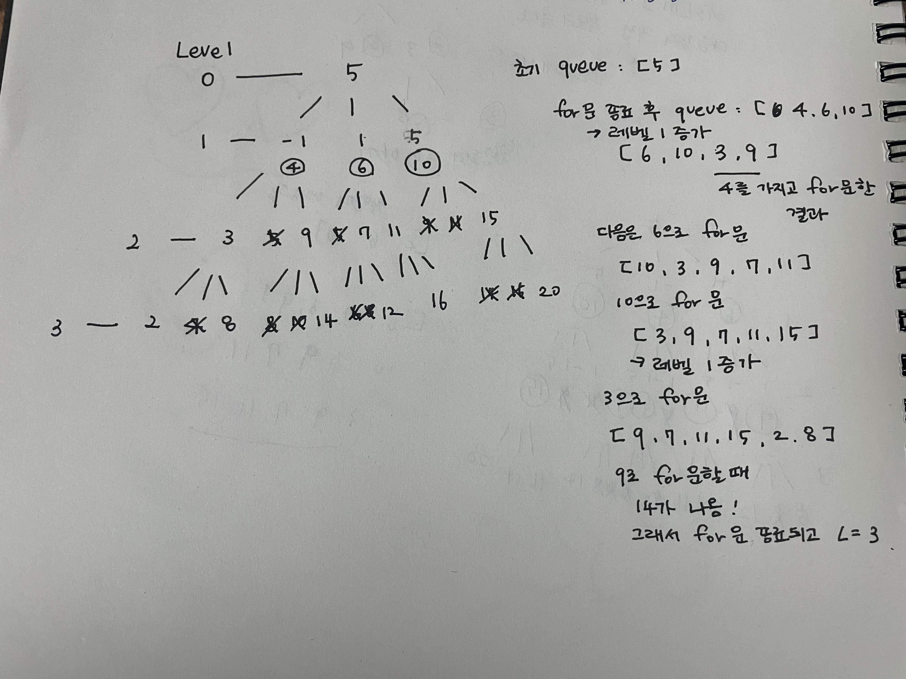

# 그래프와 탐색(DFS, BFS:넓이우선탐색)

## 1. 그래프와 인접행렬

## 21.08.19

### My solution 👩🏻‍💻

### Teacher's solution 👨‍🏫

그래프에 대한 이론 공부


---

<br>

## 2. 경로탐색(DFS-인접행렬 : 노드개수가 적을 때)

## 21.08.20

### My solution 👩🏻‍💻

이것도 선생님 풀이대로 그림을 그려보면 쉽게 이해가 된다.
1은 1, 2, 3, 4, 5까지 뻗을 수 있고, 5까지도 모든 숫자로 뻗을 수 있다.
옆에 배열을 놓고 갈 수 있는 경로인지 비교하고 하나씩 쭉 갔다가 되돌아오는 경우를 ch 배열을 적어가면서하면 이해가 잘된다!

### Teacher's solution 👨‍🏫

graph 배열 만드는 방법

```js
// 행, 열 만들기
let graph = Array.from(Array(n + 1), () => Array(n + 1).fill(0));
```

graph 방향에 따라서 갈 수 있는 경로를 넣는 방법

```js
for (let [a, b] of arr) {
  // 방향 그래프 만들기
  graph[a][b] = 1;
}
```

check 배열을 만들어 Node(or 정점)을 방문했는지 check한다.

이제 갈 수 있는 경로의 수 구하기!

```js
function DFS(v) {
  if (v === n) {
    answer++;
    console.log(path);
  } else {
    for (let i = 1; i <= n; i++) {
      // v에서 i로 갈 수 있으냐!
      // i를 방문했는지
      if (graph[v][i] === 1 && ch[i] === 0) {
        ch[i] = 1; // 방문했다고 체크
        path.push(i);
        DFS(i);
        ch[i] = 0; // 되돌아갈때 방문한 곳 체크 풀어줌
        path.pop();
      }
    }
  }
}
ch[1] = 1;
DFS(1);
```

처음 시작하는(방문하는) 노드에 대해 방문 check 처리를 해줘야 다시 처음 Node로 가는 것을 방지할 수 있다.
for문을 돌리는데, 만약 1이라면 5까지 갈 수 있는 경우를 다 돌린다.
v는 시작하는 Node를, i는 가고자하는 Node를 뜻한다.
방문할 곳이 0인 것까지 확인해야 그쪽으로 갈 수 있다는 것을 의미한다.
방문하면 방문한 노드에 해당하는 check 배열에 1을 넣어준다.
그러면 다시 그 노드에 재방문하는 것을 막을 수 있다.

---

<br>

## 3. 경로탐색(DFS-인접리스트 : 노드개수가 많을 때 적용)

## 21.08.21

### My solution 👩🏻‍💻

### Teacher's solution 👨‍🏫

graph 배열을 만드는 것이 위 문제와 조금 다르다.
graph 각 인덱스가 해당 노드를 가리키고 갈 수 있는 노드 번호만 저장하면 된다.

```js
let graph = Array.from(Array(n + 1), () => Array());
// [ [], [ 2, 3, 4 ], [ 1, 3, 5 ], [ 4 ], [ 2, 5 ], [] ]
```

DFS(1)을 해서 1번 노드부터 시작하는 것으로 하고,
중복을 방지하기 위해 ch 배열에도 미리 1번에 1을 넣어준다.
graph[v]는 v번 노드를 말하고 for문의 i를 통해 갈 수 있는 노드를 찾아낸다.
방문해준 노드는 ch를 통해 체크하고 되돌아갈 때 방문해준 것을 풀어준다.\*\*\*\*

---

<br>

## 4. 미로탐색

## 21.08.22

### My solution 👩🏻‍💻

### Teacher's solution 👨‍🏫

12시, 3시, 6시, 9시로 움직인다. D(-1, 0), D(0, 1), D(1, 0), D(0, -1)
최종 목적지는 배열의 맨 아래, 맨 오른쪽이다.
이동하면서 계속 좌표 새로 갱신해주는데, -1이 되거나 새로 방문해야할 곳이 이미 체크가 되는 곳에는 가지 못한다.
방문한 곳은 새로 체크를 걸어주고, 나중에 다시 체크를 풀어준다. (이전 방식과 동일)

---

<br>

## 5. 이진트리 넓이우선탐색(BFS)

## 21.08.23

### My solution 👩🏻‍💻

### Teacher's solution 👨‍🏫

넓이우선탐색은 **레벨 탐색**과 **최단 거리를 구하는 방법론**이다.
레벨과 queue를 사용한다.
상태트리
0번째 레벨부터 시작해 한 번만에 갈 수 있는 곳(node)가 도착지점(답)이 되는지를 판별한다.
1(0번째 레벨)을 집어넣고 1번째 레벨에서 1과 연결된 곳들을 차례로 큐에 집어넣고 넣은 순서대로 빼서 답인지 본다.
1번째 레벨에 있는 노드들과 연관된 2번째 레벨에 있는 노드들도 차례로 큐에 넣어준다.
큐의 length가 0이 되면(큐가 비어있으면) 멈춘다.

```js
function solution() {
  let answer = '';
  let queue = [];
  queue.push(1);
  while (queue.length) {
    let v = queue.shift();
    answer += v + '';
    for (let nv of [v * 2, v * 2 + 1]) {
      if (nv > 7) continue;
      queue.push(nv);
    }
  }
  return answer;
}

console.log(solution());
```

이 부분을 디버깅 툴로 돌려보면 이해가 쉽다.
1에서 시작해 첫번째 레벨인 2, 3이 들어가고 2와 연결된 2번째 레벨인 4, 5가 3과 연결된 6, 7이 들어가고, 그 와중에 큐에서 하나씩 차례로 빼준다!
answer에 7까지만 적힐 수 있도록 조건을 걸어줌.

---

<br>

## 6. 송아지 찾기(BFS)

## 21.08.24

### My solution 👩🏻‍💻

### Teacher's solution 👨‍🏫

distance 배열 혹은 레벨을 체크해서 푸는 방법이 있다.
while문 돌리는 것은 저번 문제와 비슷하다.
큐에 맨 처음 지점의 숫자를 넣고 뺀 다음 그 숫자로 갈 수 있는 경우의 수를 가지고 for문을 추가로 돌린다.
중요한 것은 ch 배열을 통해 새로운 숫자로 갔을 때 방문 여부를 체크해주는 것이고,
그 숫자를 다시 큐에 넣어서 다음 번에 큐에서 빠질 수 있도록 한다.
for문에서 계속 이동할 수 있게 만들어주는 조건은

```js
if (nx > 0 && nx <= 10000 && ch[nx] === 0) {
  ch[nx] = 1;
  queue.push(nx);
  dis[nx] = dis[x] + 1;
}
```

좌표가 1부터 10,000까지이고 중복을 방지하기 위해 체크 배열에 체크가 되지 않아야한다.
**distance 배열**을 이용하는 것은 다음과 같다.
5가 출발지점이면 ids 배열 5번 index에 0을 우선 할당한다. 출발지점이기 때문에 0이다.
그다음에 갈 수 있는 경우의 수는 -1, +1, +5에 따라 4, 6, 10인데,
dis[4], dis[6], dis[10]은 5에서 한차례 이동한 것이므로 dis[5](0)에 1을 더해 1을 할당한다.
그리고 4, 6, 10에서도 경우에 따라 이동한다면 한 차례 더 이동한 것이므로 다음에 이동할 수 index에 또 1을 더해준다.
그래서 최종값인 14에 다다를 경우에는 그 전에 이동한 수에서 한 번 이동한 것이므로 dis[14] 값이 얼마나 이동했는지를 나타내는 것이다.

**레벨**을 이용하는 방법은 다음과 같다.
간단하게 그림을 그려보면 이해가 잘 된다.

이중 for문을 이용하는데 첫번째 for문은 큐의 길이를 가지고 설정한다.
그리고 다음 for문은 queue에서 하나씩 빼내는 숫자로로 돌린다.
첫번째 for문이 다 돌았을 때는 레벨 하나가 끝났다는 의미가 되니까 레벨을 하나 더해준다.
그리고 타겟한 숫자가 나왔을 때 return 을 통해 끝내고 레벨을 하나 더해준다.

---

<br>

## 7. 섬나라 아일랜드(DFS)

## 21.08.25

### My solution 👩🏻‍💻

### Teacher's solution 👨‍🏫

우선 섬을 찾는 방법은 이중 for문으로 1이 되어있는 배열 아이템을 0번 행에서 0번째 열부터 찾기 시작한다.
1이면 섬이라는 뜻이므로 답에 1을 더해준다.
그리고 섬이 상하좌우, 대각선으로 연결되어있으므로 재귀함수를 실행시켜준다.

```js
let dx = [-1, -1, 0, 1, 1, 1, 0, -1];
let dy = [0, 1, 1, 1, 0, -1, -1, -1];
```

상하좌우 대각선 좌표 만드는 법. 직접 x축, y축 그려보니까 바로 이해됐음.
섬을 찾는 순간 재귀함수를 실행시켜주는 이유는 재귀함수에서 섬의 대각선, 상하좌우에 있는 것이 섬인지 바다인지 판별하기 위해서이다.
섬 하나를 찾아 재귀함수가 실행되면 다음 섬을 찾고 섬을 찾으면 또 그 섬에서 다음 섬이 있는지 찾는 것.
관련된 섬을 다 0으로 바꿔주면 완성.

---

<br>

## 8. 섬나라 아일랜드(BFS : 넓이우선탐색)

## 21.08.26

### My solution 👩🏻‍💻

### Teacher's solution 👨‍🏫

---

<br>
