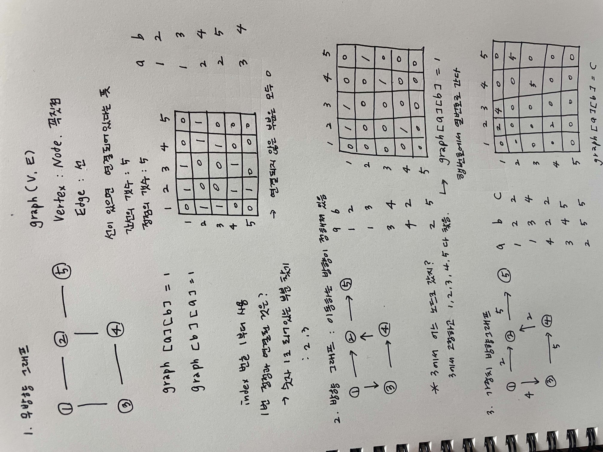

# 그래프와 탐색(DFS, BFS:넓이우선탐색)

## 1. 그래프와 인접행렬

## 21.08.19

### My solution 👩🏻‍💻

### Teacher's solution 👨‍🏫

그래프에 대한 이론 공부

---

 

## 2. 경로탐색(DFS-인접행렬 : 노드개수가 적을 때)

## 21.08.20

### My solution 👩🏻‍💻

### Teacher's solution 👨‍🏫

---

 

## 3. 경로탐색(DFS-인접리스트 : 노드개수가 많을 때 적용)

## 21.08.21

### My solution 👩🏻‍💻

### Teacher's solution 👨‍🏫

---

 

## 4. 미로탐색

## 21.08.22

### My solution 👩🏻‍💻

### Teacher's solution 👨‍🏫

---

 

## 5. 이진트리 넓이우선탐색(BFS)

## 21.08.23

### My solution 👩🏻‍💻

### Teacher's solution 👨‍🏫

---

 

## 6. 송아지 찾기(BFS)

## 21.08.24

### My solution 👩🏻‍💻

### Teacher's solution 👨‍🏫

---

 

## 7. 섬나라 아일랜드(DFS)

## 21.08.25

### My solution 👩🏻‍💻

### Teacher's solution 👨‍🏫

---

 

## 8. 섬나라 아일랜드(BFS : 넓이우선탐색)

## 21.08.26

### My solution 👩🏻‍💻

### Teacher's solution 👨‍🏫

---

 
